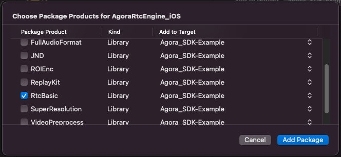
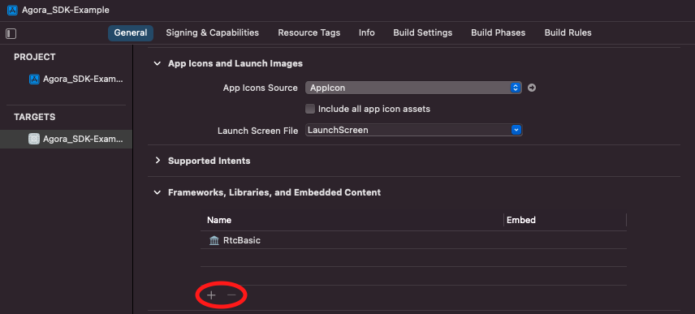

# Agora Swift Package Manager

  

Install Agora Video SDK easily with Swift Package Manager.

[Click here for full documentation](https://docs.agora.io/en/Video/landing-page?platform=iOS).

## Installation

Add the URL of this repository to your Xcode 12+ Project.

Go to File > Swift Packages > Add Package Dependency, and paste in the link to this repository:

`https://github.com/AgoraIO/AgoraRtcEngine_iOS`

When prompted to choose package products, be sure to check the required "RtcBasic" product:

  

If you later want to add or remove products from the package, go to "General > Your App Target > Frameworks, Libraries and Embedded Content" to remove or add products from the package:

  

More information about these additional products can be found here:

https://docs.agora.io/en/Video/reduce_rtc_app_size?platform=iOS

---

If you have issues installing this Swift Package:

In Xcode's File menu, select 'Swift Packages' and then 'Reset Package Caches'.

